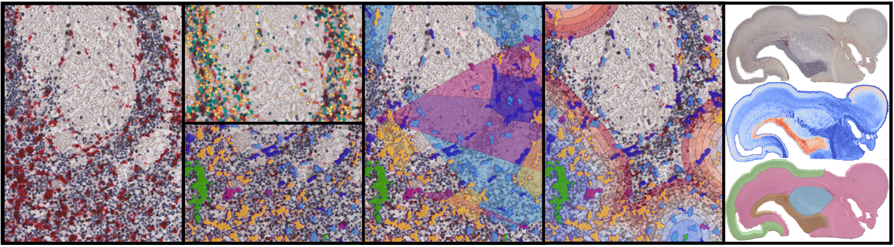

DeepCellMap ✨
===========
## Unraveling Microglial Spatial Organization in the Developing Human Brain with DeepCellMap
*Nature Communications*

 [Journal Link](https://www.nature.com/articles/s41467-025-56560-z) 




`DeepCellMap` is a Python package containing methods for analyzing the spatial distribution of cells in tissues (histological images and fluorescence images). DeepCellMap consists of various independent modules enabling cell detection and classification, segmentation of anatomical regions, analysis of cell-cell and cell-region couplings, as well as analysis of the distribution of cell populations in clusters and the interactions between clusters of different populations.


# How tu use DeepCellMap ? 

The notebooks provided in `./DeepCellMap_V2_general_use/` offer a step-by-step guidance for users (with a minimum of Python experience) in using DeepCellMap with any dataset. In addition to the explanations provided in the notebooks, the user can consult the documentation in `./docs`, where the following documents can be found: 

-  `Application of DeepCellMap to a new Dataset.pdf`
- `ConfigFile_explanation_(1_dataset__1_Config_file).pdf` and 
- `DeepCellMap_files_overview_.pdf`

Brief explanation of each notebook: 

1. **`DeepCellMap_1_image_preprocessing.ipynb`** performs image downscaling, tissue mask extraction and tiling 
2. **`DeepCellMap_2_laboratory_Tissue_segmentation.ipynb`** (optional) : helps to find good method to segment tissue of the entire image 
3. **`DeepCellMap_3_laboratory_Cell_segmentation.ipynb`** (optional) :  helps to find good method to segment cells in tissue
4. **`DeepCellMap_4_cell_classification.ipynb`** (optional) : is used to classify cells using a deep learning based model after cell detection and segmentation 
5. **`DeepCellMap_5_application_DeepCellMap.ipynb`** enables the application of DeepCellMap on entire images or ROI in images. 


**Note: the code is regularly updated to make it easy to use in a wide range of contexts. If you have any questions, please don't hesitate to contact us: theo.perochon@hotmail.fr**

## Reference
If you find our work useful in your research or if you use parts of this code please consider citing our [paper](https://www.nature.com/articles/s41467-025-56560-z):

Perochon, T., Krsnik, Z., Massimo, M., Ruchiy, Y., Romero, A. L., Mohammadi, E., ... & Holcman, D. (2025). Unraveling microglial spatial organization in the developing human brain with DeepCellMap, a deep learning approach coupled with spatial statistics. Nature Communications, 16(1), 1577.


```
@article{perochon2025unraveling,
  title={Unraveling microglial spatial organization in the developing human brain with DeepCellMap, a deep learning approach coupled with spatial statistics},
  author={Perochon, Theo and Krsnik, Zeljka and Massimo, Marco and Ruchiy, Yana and Romero, Alejandro Lastra and Mohammadi, Elyas and Li, Xiaofei and Long, Katherine R and Parkkinen, Laura and Blomgren, Klas and others},
  journal={Nature Communications},
  volume={16},
  number={1},
  pages={1577},
  year={2025},
  publisher={Nature Publishing Group UK London}
}
```
