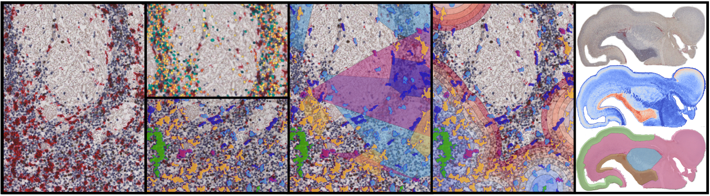

# DeepCellMap

Algorithms associated with the submission of the paper titled
\"Spatiotemporal mapping of human microglia during brain development
with advanced spatial statistics assisted by deep-learning\" to Nature
Methods.

This directory contains all the source code needed to reproduce the
results of the paper using different notebooks (doc/src/notebooks). Some
intermediate results have been provided (doc/data) to speed up the
calculation of spatiotemporal statistics on several pre-defined regions
of interest.
